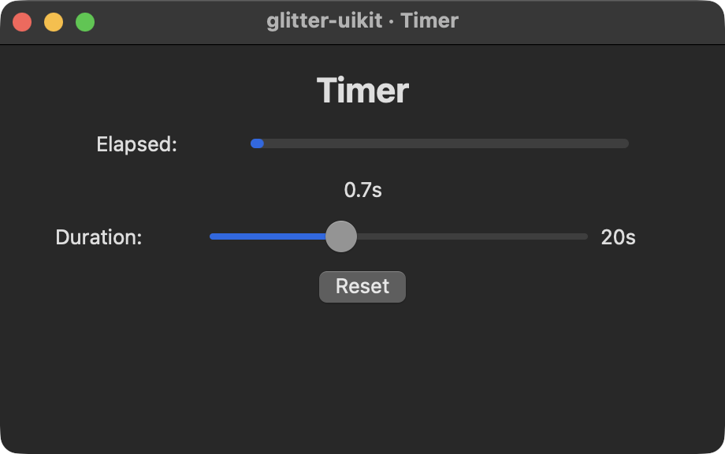

# Demos

Screenshots of glitter-uikit's interactive demos, rendered through AppKit. The images here are committed, so you do not need the capture tool to browse them.

`todo.png` is a plain `screen-grab shot` of the demo's initial state and regenerates faithfully. **`counter.png` was steered by hand** — a person clicked `+ 1` five times and focused the window before the frame was taken — because an automated capture cannot drive it: the app's accessibility subtree does not populate from a cold, unattended launch, so a recorded flow finds no button to press. Synthetic input itself works fine once a control is focused through an accessibility tap (measured: a flow drove the counter 0 -> 3 and typed 100 into the converter, which correctly showed 212); it is the COLD-LAUNCH tree that is the blocker. A normal re-run leaves it alone: the ledger hashes each item's `:src`, so an unchanged `counter.clj` reports `up to date` (verified). But `--force`, or any edit to `counter.clj`, WILL recapture it and silently replace the steered frame with an initial-state one reading `Count: 0`. If that happens, re-steer it by hand rather than committing the regression.

## basics

### counter

The canonical demo. One state atom, a pure state -> hiccup view, handlers as data.

### widgets

### todo

A task board on glitter.nexus: derived counts computed inline, an entry, and checkbutton toggles.

## Other

### temperature

### flights

### timer

