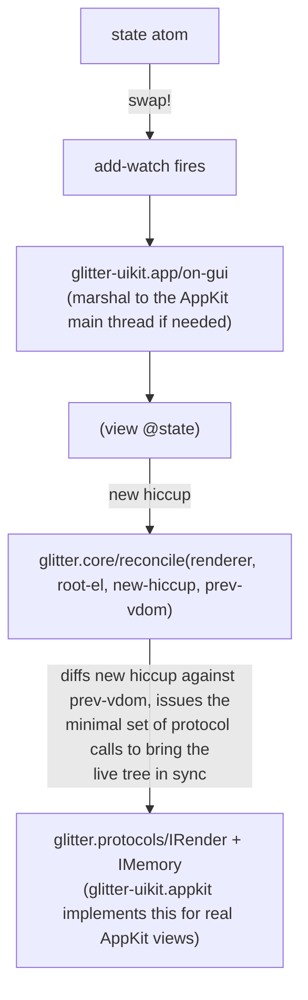

# Architecture

## What glitter-uikit is (and isn't)

`glitter.core` (ported from `replicant.core`) owns the entire reconciler —
the diff algorithm that decides what changed between two hiccup trees and
what to do about it — plus the `IRender`/`IMemory` protocols in
`glitter.protocols` that it drives. Neither namespace knows anything about
AppKit, or even that AppKit exists.

`glitter-uikit` supplies the other half: real AppKit views
(`glitter-uikit.widget`), the `IRender`/`IMemory` implementation that wires
them into the reconciler (`glitter-uikit.appkit`), and the app loop that
gets an `NSApplication` running in the first place
(`glitter-uikit.app`). This is a **whole alternative renderer** — the
AppKit counterpart of `glitter.gtk` — chosen at `mount!`'s call site by
which library an app requires, not a widget registered into some shared
component registry inside `glitter.core` itself.



## One `reify`, not two composed pieces

`glitter-uikit.appkit/renderer` implements `IRender` *and* `IMemory` in a
single `reify` form, rather than composing two separately-built pieces.
This is deliberate, not incidental: the code's own comment on the point
reads

```clojure
;; IMemory, folded into the SAME reify form rather than composed via
;; metadata: :extend-via-metadata is verified broken under Jolt (see
;; glitter's porting-and-attribution.md). Keyed off the el atom, which is
;; already a stable Clojure identity, rather than the raw view pointer.
```

The verification itself lives in glitter's own porting notes, not
re-derived here: `glitter.protocols` declares both protocols with
`:extend-via-metadata true` (mirroring Replicant's own
`replicant.protocols`), and Replicant's test helper
(`replicant.mutation-log`) actually relies on that — composing `IRender`
plus a logging concern via `with-meta`. Requiring that helper under Jolt
and calling its renderer throws `No method create-element in
replicant.protocols/IRender`. `:extend-via-metadata` simply doesn't
dispatch under Jolt; `reify` does. Both `glitter.gtk` and
`glitter-uikit.appkit` implement `IRender`+`IMemory` together in one
`reify` because of that finding, not by parallel taste.

## The el atom: a tracking atom, not a raw pointer

`create-element` and `create-text-node` don't hand the reconciler a raw
AppKit view pointer. They return a Clojure atom:

```clojure
{:tag <hiccup tag keyword>
 :view <AppKit view pointer>
 :children [<child el atom> ...]
 :handlers {<event keyword> <handler fn>}}
```

(`mount!` builds the same shape by hand for the root element, tagging it
`:window` over the caller-supplied `NSWindow` pointer.)

There are two separate reasons this is an atom holding a small map, not
the pointer itself.

The first is shared with `glitter.gtk`: `glitter.core`'s reconciler wants
an opaque, stable identity per live-tree node to hold across renders —
`IMemory`'s `remember`/`recall` key off it, and keyed-list diffing needs
something to compare across two renders that isn't just "the same pointer
happened to come back." An atom is already a stable Clojure identity, so
`remember`/`recall` can use it as a map key without any question of
whether a Jolt FFI pointer hashes or compares correctly.

The second is AppKit-specific, and it's about registry cleanup, not
identity. An `NSControl` has exactly one target/action slot, and the
shared ObjC method implementations that receive its callback —
`fire-cb`/`change-cb` in `glitter-uikit.widget` — are typed
`[:pointer :pointer :pointer] :void`: `(fn [_self _cmd sender] ...)`. The
IMP gets a raw sender pointer and nothing else — no Clojure closure can
travel across that boundary. So dispatch has to go through **global,
process-wide Clojure atoms keyed by raw view pointer**
(`glitter-uikit.widget/actions`, `/changes`, `/alignments`), owned
end-to-end by `glitter-uikit.appkit`.

That's a real hazard GTK doesn't share. GTK's per-widget signal
connections live on the `GObject` itself (`g_signal_connect_data` returns
a connection id, `g_signal_handler_disconnect` uses it) — there's no
external Clojure-side table for a freed widget to leave stale. AppKit's
port has exactly that table, and AppKit reuses freed pointer addresses.
An un-scrubbed entry in `actions`/`changes`/`alignments` isn't just a
leak: a brand-new, entirely unrelated view can allocate at the same
address a removed one used to occupy and silently inherit its stale
handler. `glitter-uikit.appkit/forget-subtree!` exists to close that
window — every `IRender` method that detaches a subtree (`remove-child`,
`replace-child`'s displaced node, `remove-all-children`) calls it first,
and it walks `(:children @el)` recursively, calling
`glitter-uikit.widget/forget-view!` on every descendant's pointer before
that memory can be reused. That walk is only possible because the el atom
carries `:children` — a raw pointer alone couldn't be walked at all.

`:handlers` on the el atom itself is a bookkeeping mirror, not a second
source of truth: `set-event-handler`/`remove-event-handler` write it
(`swap! el assoc-in [:handlers event] f`, `swap! el update :handlers
dissoc event`), but nothing in this codebase reads it back except a test
asserting it starts as `{}`. The live dispatch tables are
`glitter-uikit.widget/actions` and `/changes`.

## `mount!`'s wiring

```clojure
(defn mount!
  [window view state-atom]
  (let [r (renderer)
        root-el (atom {:tag :window
                       :view window
                       :children []
                       :handlers {}})
        vdom (atom nil)
        render! (fn [state]
                  (reset! vdom (:vdom (core/reconcile r root-el (view state) @vdom
                                                      {:aliases (alias/get-registered-aliases)}))))]
    (render! @state-atom)
    (add-watch state-atom ::render (fn [_ _ _ state] (app/on-gui (fn [] (render! state)))))
    nil))
```

The root element is the `NSWindow` pointer itself, tagged `:window` — an
`NSWindow` is a single-child container in this port
(`glitter-uikit.widget`'s `:window` spec has `:container :window`, and
`append-child!`'s `:window` branch pins the mounted view to
`window-content`), so the view function's return value becomes the
window's one content child, not a replacement for the window.

Every re-render goes through `glitter-uikit.app/on-gui`, never called
directly — a `swap!` on `state-atom` can originate from any thread (an
nREPL eval's worker thread, a `future`), and `on-gui` is what makes
routing that safely onto the AppKit main thread possible. See
[`app-loop-and-threading.md`](app-loop-and-threading.md).

Registered aliases (`glitter.alias/get-registered-aliases`) are merged
into every reconcile call automatically via `{:aliases ...}`, so an app
never has to thread its alias registry through by hand.

## The event model: data, not a closure wired once

This is the port's central adaptation, and it's worth naming precisely
what changed. `glitter-uikit.widget` was forked from `glimmer-uikit`,
whose Reagent-style model wires target/action **once, at widget
creation**, via `connect-signals!` — reading from the widget's own source
confirms this: `glimmer_uikit/widget.clj` has

```clojure
(when-let [h (:on-click props)]    (swap! actions assoc widget h))
```

called from `create!`, once, and the stored handler `h` is a plain
closure the caller passed as `:on-click`. If the click behavior needs to
change, the caller re-mounts or re-derefs a reactive cell the closure
already closes over — the target/action wiring itself never changes.

glitter's hiccup carries handlers as **data** instead:
`[:button {:on {:click [[:action/inc]]}}]`. `glitter.core`'s diff calls
`IRender/set-event-handler` again whenever that data changes between
renders — not just once at creation — because the action tuples for the
same event on the same element can differ across two renders without the
event key itself changing. `glitter-uikit.appkit`'s `set-event-handler`
has to actually do something on every one of those calls:

```clojure
(set-event-handler [_ el event handler _opt]
  (let [view (ptr el)
        tag  (:tag @el)
        f    (dispatcher el tag event handler)]
    (cond
      (contains? action-events event)
      (do (u/control-target! view w/invoker)
          (u/control-action! view (u/sel "fire:"))
          (swap! w/actions assoc-in [view event] f))

      (= :change event)
      (do (u/control-delegate! view w/invoker)
          (swap! w/changes assoc view f))

      :else nil)
    (swap! el assoc-in [:handlers event] f))
  nil)
```

`action-events` is `#{:click :toggled :activate}` — these route through
`NSControl`'s target/action slot, redirected to the single shared
`GlitterTarget` instance (`w/invoker`) and its `fire:` selector.
`:change` routes through the `NSTextField` delegate instead
(`controlTextDidChange:`), also on `w/invoker`. Either way, the actual
handler function `f` lands in a pointer-keyed registry
(`glitter-uikit.widget/actions` or `/changes`) — the same structural
requirement described above: `fire-cb`/`change-cb` receive only the
sender pointer, so dispatch has to be a global lookup by that pointer.
The el atom's `:handlers` map gets the same write purely for bookkeeping,
as noted above.

`dispatcher` wraps the caller's `handler` (a `glitter.core`-supplied fn
of one event map) as the one-arg fn the ObjC callback actually invokes:

```clojure
(fn [sender]
  (let [value-fn (@signal-value [tag event])]
    (handler (cond-> {:glitter/node el
                      :glitter/appkit-view sender}
               value-fn (assoc :glitter/value (value-fn sender))))))
```

`:glitter/node` is the key `glitter.core`'s own `build-event-map` reads
on Jolt to recover the acting element, since there's no DOM
`event.target` to fall back on. `signal-value` is a small table of
`[tag event] -> (fn [view] value)` extractors (e.g. `[:entry :change]`
reads `control-string`) — every entry **re-reads the view's own current
property** rather than trusting a value the callback happened to carry,
which is safe here because AppKit updates a control's property before
invoking its action/delegate, mirroring the identical choice in
`glitter.gtk`.

`remove-event-handler` and `clear-target-if-unused!` are the other half:
removing the last action handler for a view drops its entry from
`w/actions` and clears the control's `target` back to null via
`control-target!`. Note this clears only `target`, not the `action`
selector itself (still `fire:`) — harmless, since AppKit has nothing to
send the action message to once `target` is null.

## The `:ctor` finding: props always arrive empty

`glitter.core`'s `create-node` calls `IRender/create-element` with only an
optional XML-namespace hint, never the real hiccup props:

```clojure
;; glitter/core.clj — create-node's actual call
(r/create-element renderer tag-name (when ns {:ns ns}))
```

`ns` is non-nil only for SVG/`foreignObject` hiccup, which no AppKit
widget in this project ever produces — so for glitter-uikit, `options` is
always `nil` at this call site. `glitter-uikit.appkit`'s
`create-element` reflects that directly:

```clojure
(create-element [_ tag-name options]
  (let [tag (keyword tag-name)
        view (w/create! tag (or options {}))]
    ...))
```

`(or options {})` means `w/create!` — and therefore a spec's `:ctor`, and
the `:apply` call `create!` makes right after constructing the view — is
always invoked with `{}` through the real reconciler path. The real prop
values arrive afterward, one key at a time, through a different path
entirely: `glitter.core`'s `set-attributes` calls `set-attr` per key
(`run!` over the new attrs map), which reaches `IRender/set-attribute`
once per attribute. `glitter-uikit.appkit`'s implementation forwards each
call as a single-key partial map:

```clojure
(set-attribute [_ el a v _opt]
  (w/apply-props! (:tag @el) (ptr el) {(keyword a) v})
  nil)
```

The consequence for anyone writing a widget spec: a `:ctor` that branches
on a prop value is dead code along the real reconciler path — the
widget's actual observable state depends entirely on whether `:apply`
independently handles that same key once `set-attribute` delivers it.
`button-spec`'s `:ctor` reads `(:label p)`, but `p` is always `{}` there;
the button's real label comes from `:apply`'s
`(when (contains? p :label) (u/control-title! w (:label p)))`, invoked
later through `apply-props!` once glitter.core sends the real `:label`
attribute through. Every spec in `glitter-uikit.widget` follows that
shape — `:ctor` builds a bare, presentable view; `:apply` is what any
real prop value actually reaches.
