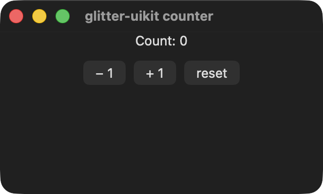
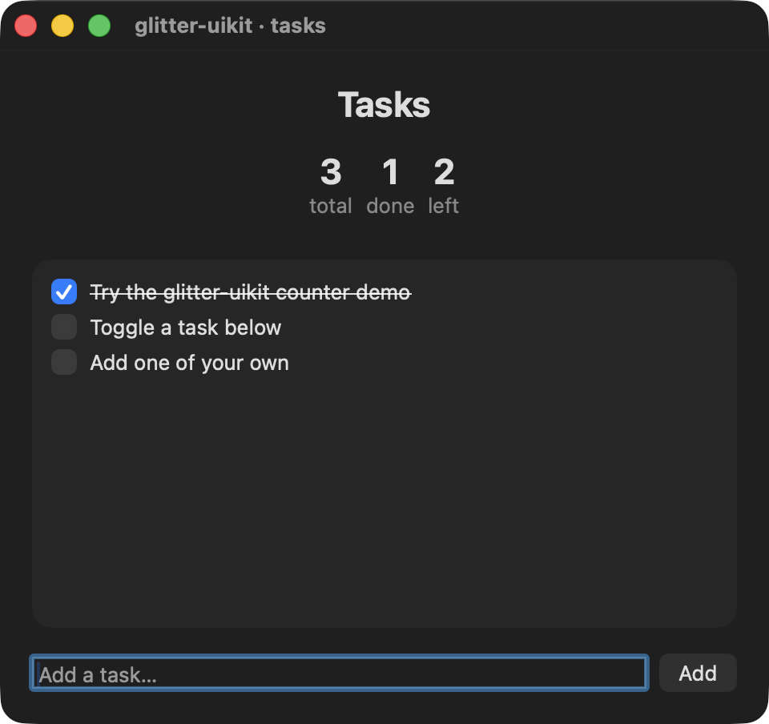

# The examples

Everything runnable lives under `examples/glitter_uikit/`. Two of those
namespaces are **interactive demos** you open and click — `counter.clj` and
`todo.clj` — covered here. The rest are live-AppKit smokes: they mount a
real window, assert against real AppKit state, and exit non-zero on
failure; see [`testing-and-tasks.md`](testing-and-tasks.md) for those.

Run either demo with `bb <name>`, or `jolt -M:<name>` without babashka.

## Interactive demos

| preview | `bb` name | What it demonstrates |
|---|---|---|
|  | `counter` | The canonical demo. One state atom, a pure `state -> hiccup` view, handlers as data. The whole model in a window you can click through in ten seconds. |
|  | `todo` | A task board on `glitter.nexus`: derived counts (3 total / 1 done / 2 left) computed inline on every re-render — glitter has no reactive-derivation primitive — plus an entry with `:change`/`:activate`, checkbutton toggles, and list rendering in a frame. The counts row is the whole point: it's recomputed from `:tasks` on every render, not tracked as separate state. |

Every preview is a real screenshot of the demo running, not a mockup. They
are committed under `docs/demos/`, and each thumbnail links to the
full-size image.

## Why the demos are worth reading, not just running

`counter.clj` says it directly in its own docstring: in glimmer-uikit
(the Reagent-style sibling this project was ported from), local state
lives in a component-scoped ratom and a click closure calls `swap!`
itself. Here all state is in one top-level atom, the view is a pure
function of it, and click handlers are *data* dispatched through one
global fn, never closures. `todo.clj` makes the same contrast at larger
scale, and adds the derived-counts point: there is no memoized selector,
no reaction, no cache — the three numbers above the task list are just
arithmetic over `:tasks` re-run on every render, because re-running the
whole view is the model.

## Stills, not animations — a deliberate, revisitable choice

glitter's own gallery steers its demos with a scripted Tab/Space input
timeline to record short GIFs. That recipe is verified against GTK and
does not obviously carry to AppKit: on macOS, Tab moves focus between
text fields and lists, and reaching a *button* by keyboard requires
"Full Keyboard Access" to be enabled in System Settings — not a safe
assumption to bake into a capture script without first verifying it
against a real AppKit window. Rather than assume the GTK timeline
transfers, these two screenshots were captured with `:driver :spawn` and
no synthetic input at all — see `scripts/demo_manifest.edn` for the full
reasoning. Upgrading to GIFs is a deliberate follow-up that starts by
probing what steering actually reaches an AppKit window, not a gap left
by oversight.

## Adding an example

Two touchpoints, and skipping either leaves the example invisible to
something:

1. **The namespace** under `examples/glitter_uikit/`, plus a `deps.edn`
   alias so `jolt -M:<name>` works without babashka.
2. **A `bb.edn` task**, so `bb <name>` works and it shows up in `bb info`.

If the new example is a screenshot-worthy interactive demo, add it to
`scripts/demo_manifest.edn`'s `:examples` and regenerate with
`screen-grab shot --manifest scripts/demo_manifest.edn`, then add its row
to the table above.
