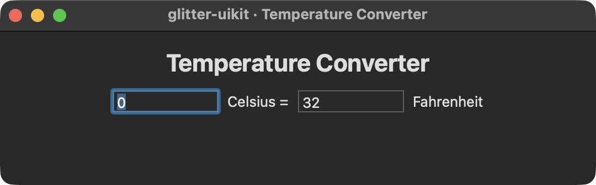
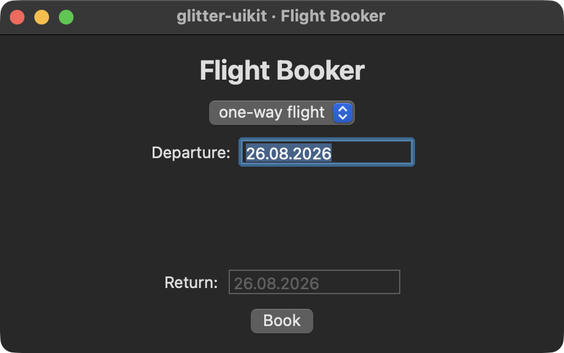
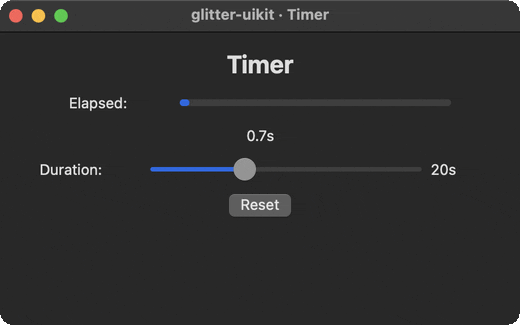
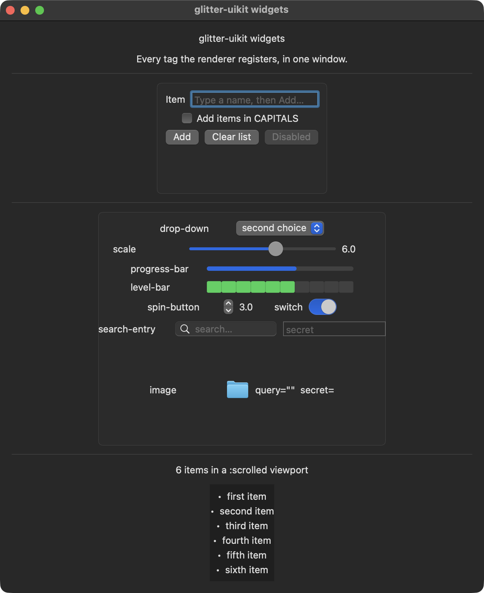

# The examples

`examples/glitter_uikit/` holds **fourteen runnable namespaces**, and every one
has a `deps.edn` alias and a `bb` task. They come in two kinds:

- **Six interactive demos** you open and click — the galleries below.
- **Eight live-AppKit smokes**, each a small, complete glitter program that
  mounts a real window, asserts against real AppKit state, and exits non-zero
  on failure.

Run any of them with `bb <name>`, or `jolt -M:<name>` without babashka.
`bb info` prints the whole list grouped, and `bb smokes` runs all eight smokes
in sequence, stopping at the first failure.

All fourteen need a GUI session — and GTK4 installed, even though this renderer
never calls a GTK function. See [Limitations](limitations.md) for why.

## Interactive demos

| preview | `bb` name | Task | What it demonstrates |
|---|---|---|---|
|  | `counter` | [Counter](https://eugenkiss.github.io/7guis/tasks/#counter) | The canonical demo. One state atom, a pure `state -> hiccup` view, handlers as data. The whole model in a window you can click through in ten seconds. |
|  | `temperature` | [Temperature Converter](https://eugenkiss.github.io/7guis/tasks/#temp) | Two linked numeric fields, each edit updating the other. Its domain half is glitter's, carried across unchanged — the pure part of a glitter app is renderer-agnostic, which is the point of the split. |
|  | `flights` | [Flight Booker](https://eugenkiss.github.io/7guis/tasks/#flight-booker) | Constraints *between* widgets and *within* one: a `:drop-down` choosing one-way/return, two strictly-validated date fields, and a Book button gated on both. |
|  | `timer` | [Timer](https://eugenkiss.github.io/7guis/tasks/#timer) | The only demo whose state advances **on its own** — a repeating `NSTimer` drives a `:progress-bar`, and moving the `:scale` changes the duration immediately rather than at the next tick. |
|  | `todo` | — | A task board on `glitter.nexus`: derived counts computed inline on every re-render (glitter has no reactive-derivation primitive), an entry with `:change`/`:activate`, checkbutton toggles, list rendering in a frame. |

7GUIs tasks 1 through 4 ship. **`crud`** (task 5) is the one still out of reach:
it needs `:list-box`, i.e. `NSTableView`, which requires a data source and a
delegate bridged through the FFI — more work than every other widget in this
renderer combined, which is why it was deliberately left out.

## The widget gallery

| preview | gallery |
|---|---|
|  | **`bb widgets`** — every tag the renderer registers, in one window. One state key, `:level`, is read by **three widgets at once**: a `:scale` drives it while a `:progress-bar` and a `:level-bar` display it, so dragging the slider shows a single key re-rendering everything that reads it. It is also the only example that exercises `:separator` and `:scrolled`. |

## Why the demos are worth reading, not just running

`counter.clj` says it directly in its own docstring: in glimmer-uikit (the
Reagent-style sibling this project was ported from), local state lives in a
component-scoped ratom and a click closure calls `swap!` itself. Here all state
is in one top-level atom, the view is a pure function of it, and click handlers
are *data* dispatched through one global fn, never closures.

`todo.clj` makes the same contrast at larger scale, and adds the derived-counts
point: there is no memoized selector, no reaction, no cache — the three numbers
above the task list are just arithmetic over `:tasks` re-run on every render,
because re-running the whole view is the model.

The three 7GUIs ports make a different point. Their domain halves —
`set-temperature`, `parse-date` / `get-form-state`, `get-view-state` — are
carried over from glitter **unchanged**, because they are pure Clojure with no
toolkit in them. Only the view and the `-main` differ. That is the renderer
split doing exactly what it exists to do.

## Findings worth knowing, from porting the 7GUIs demos

### `:width-chars` is not a width

Nothing in this renderer could give a control a width until `flights.clj` needed
one. `:width-chars` looks like the answer and is not — it routes to
`setPreferredMaxLayoutWidth:`, a text-*wrapping* hint that leaves a control free
to be compressed to nothing. The measured consequences were not subtle: an
`:entry` beside a label was squeezed to **zero width** and vanished, and where
it survived, a ten-character date rendered as `26.08.20`.

Four plausible routes were each tried against a live window and each did
nothing: `:vexpand false` on the container, `:hexpand true` on the field,
`:hexpand true` on the row, and `:halign :fill`. What works is `:width-request`,
which installs a real `NSLayoutConstraint`. The full table is in
[Limitations](limitations.md#sizing-width-chars-is-not-a-width-width-request-is).

### Lenient date parsing

`flights.clj` does not call `t/parse-date` directly. glitter verified that it is
**lenient** under this Jolt port: `"27.03.2014x"` parses to 2014-03-27 ignoring
the trailing garbage, `"not-a-date"` parses to `-0001-11-30`, and `"31.02.2014"`
— not a real date — rolls over to 2014-03-03. The round-trip wrapper (parse,
reformat with the *same* formatter, reject unless it matches the trimmed input
exactly) is what actually makes the spec's "coloured red when ill-formatted"
rule work. All four traps are re-verified here.

## Live-AppKit smokes

These are examples in exactly the sense the demos are — each mounts a window and
drives a real glitter view. What makes them smokes is that they then *assert*,
against the live AppKit tree rather than against the renderer's own bookkeeping,
which would agree with itself and pass even if no AppKit call ever landed.

`bb smokes` runs all eight in sequence and stops at the first failure. The full
argument for each — the exact assertions, and why each is shaped to fail loudly
instead of passing vacuously — is in
[Testing and tasks](testing-and-tasks.md#live-appkit-smokes). The tables below
are the index; that page is the argument.

## Smokes: reconciler behaviour

| `bb` name | Pins |
|---|---|
| `smoke` | A view function renders into a real `NSWindow`, and a state-atom write re-renders it. Start here. |
| `keyed-smoke` | A keyed reorder lands in the right live order **and reuses the same view pointers** rather than recreating them. Also pins the no-suppression property this renderer is built on. |
| `replace-child-smoke` | A replaced child stays at its **exact index**, not appended at the end — the `glimmer-uikit` original's bug. |
| `insert-before-smoke` | A new child lands mid-list; an existing child's keyed reorder **moves** rather than duplicates; a *forward* move lands at the sibling's un-incremented index — this port's own final-review fix. |

## Smokes: events and value delivery

| `bb` name | Pins |
|---|---|
| `reactivity-smoke` | A programmatic state write re-renders in place, **and** a real `-[NSControl performClick:]` dispatches through the target/action path the renderer actually wired — not a direct handler call, which would prove nothing about the wiring. |
| `handler-cleanup-smoke` | Unmounting a subtree drops every handler registration it held, **grandchildren included**. AppKit reuses freed addresses, so a leaked registration can be inherited by a newly allocated view at the same address. |

## Smokes: threading

| `bb` name | Pins |
|---|---|
| `main-thread-smoke` | A state change made from a **non-main thread** still renders on the AppKit main thread — the property the `CFRunLoopSource` scheduler exists for. |
| `repl-live-smoke` | The same marshalling, shaped like a live nREPL session: a worker thread mutates state while the app runs. An unmarshalled render touching AppKit off-main aborts the process outright, so surviving is itself part of the assertion. |

## Stills, not animations — with one real exception

glitter records a GIF per demo by steering it with a synthetic Tab/Space/type
`:input` timeline. That recipe is verified against GTK and **does not reach an
AppKit window**: probed here, five Tab/Space presses left the counter at 0 with
no focus ring, and `:type` left a focused `NSTextField` showing only its
placeholder. On macOS a button takes keyboard focus only under "Full Keyboard
Access". So every demo that needs a keystroke to do anything is a still.

`timer` is the exception, and glitter's own manifest agrees — its timer entry is
`{:duration 10}` with no `:input` either. The demo animates by itself, so the
GIF above is a recording of the thing genuinely working, with nothing
synthesised. It is produced by a separate manifest,
`scripts/demo_gifs.edn`, with its own ledger and README: screen-grab keys a
ledger entry by `:id` alone, so a `record` run and a `shot` run sharing an
output directory overwrite each other's entries.

One further caveat if you touch `counter`: its committed screenshot shows
`Count: 5` because a person clicked the button five times. That frame cannot be
regenerated by the tool. The ledger hashes each item's `:src`, so an unchanged
`counter.clj` reports `up to date` and the frame is safe — but editing
`counter.clj`, or passing `--force`, recaptures it as an initial-state
`Count: 0`. Re-steer it by hand rather than committing that.

## Adding an example

Two touchpoints, and skipping either leaves the example invisible to something:

1. **The namespace** under `examples/glitter_uikit/`, plus a `deps.edn` alias so
   `jolt -M:<name>` works without babashka.
2. **A `bb.edn` task**, so `bb <name>` works and it shows up in `bb info`.

Then add its row here — to the demo gallery, or to the smoke index above. A new
smoke also belongs in `bb smokes` and in
[Testing and tasks](testing-and-tasks.md#live-appkit-smokes), which is where its
assertions get explained.

If the new example is a screenshot-worthy interactive demo, add it to
`scripts/demo_manifest.edn`'s `:examples` and regenerate with
`screen-grab shot --manifest scripts/demo_manifest.edn`. If it animates on its
own, without needing input, it can go in `scripts/demo_gifs.edn` instead and be
recorded with `screen-grab record`.
